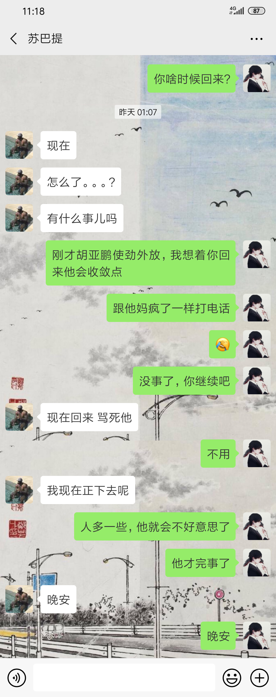

今天晚上我的一个室友(胡亚鹏)，打电话外放到1点，我当时是真的很生气，关于以前的我早就发火了，但是今天没有，我忍住了。我想发泄自己的怒火(发个朋友圈)，但当我打字快打完了的时候，我意识到这件事有些欠妥当，似乎有些幼稚了，于是我就没发送出去。 转而我想到一个方法，我让我那个去别的人(苏吧)宿舍喝酒回来，这样的话，一来可以让那个外放的人立于众矢之的，二来人多了以后，他就可能会收敛点，三来那个打电话外放的人是个欺软怕硬的货，他(外放的那个人)也会有所忌惮。

  

事情比较巧我给苏吧发消息的时候，因为有些困，发给了 胡 ，内容为“你什么时候回来?” 。发完了之后我才意识到我发错了人，但为时已晚，想撤回又会引起误会，索性又发了一条(内容为“发错了”)，我想着这样子补救我的失误，一来可以给 胡 提个醒，二来告诉他我已经对他不满意了，让他收敛点，三来可以告诉他，宿舍里讨厌他的人除了我和胖子还有别人，也算是向他提个醒。我发错消息之后 胡 消停了不少，胡 准备睡觉的时候，苏吧回来了。

其实我在发错消息的同时也向苏吧发了一条消息，向他说明了我为什么想让他回来(聊天记录如附图)

  

事后第二天，宿舍里明显的增加了对 胡 的不满，人类对那些有让自己反感行为的人容忍度更加的低。一但一个圈子里，一个人a开始讨厌一个人b，而错(这个圈子所公认的错)也在b的情况下，那么b就会越来越被更多的人所讨厌(从而进一步的触发犹太效应)，最终沦为所有人所讨厌的对象。
