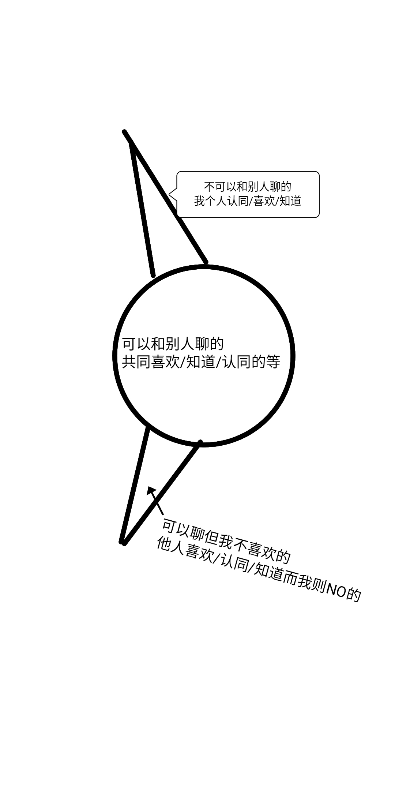

每个人都有自己的周期（命运、生理等等），就是类似三角函数的那种周期，但是这个周期并不规律。

人类是物质的还是精神的，或许精神和物质本质上也是一回事。人类有自己的周期有自己的振幅频率等等，人类也是一种波（无论是精神上的还是物质上的）（这里在一定程度上对应了物质波的一些东西，哈哈）

而且人类的周期会被外界的周期所影响（也会发生干涉现象，这是很有趣的），例如人就会被月亮的周期所影响（满月左右的时候人类睡眠质量会降低，睡的时间会增多），表面上只能看到生理上的，但实际上对我们的命运周期也有影响的，只不过很多人感觉不到（也可以这么理解，睡得不好，做事反应迟钝容易出错，进而影响自己的仕途）。

趋吉避凶，随着时间的流淌，每个人只要用点心思都可以稍微摸清自己所处在周期的什么地方（要么是上升期，要么是下降期）（只要自己顺着道去做事去生活去选择，虽然小范围内可能会有下降，但是从人类自己一生的角度来说绝对是上升的，至于能上升到什么程度，这取决于一个人的命数（环境、基因等等都属于命运或者说命数的一种））
___
我自己喜欢的东西和我自己愿意深入了解的东西，别人并不一定喜欢，因为这个世界上有那么多事物，我喜欢a你喜欢b他喜欢c，每个人都不同的，所以不要和别人聊一些他们听不懂的东西，这会令别人感到无所适从，因为他们没兴趣也听不懂，你可以和他们聊一些大众都有兴趣的（例如某些人就喜欢聊sex），或者一些普世知道的知识，来找到话题。

___
你个东北人用你家乡的那种说话方式和非东北人说话，他怎么可能接受的了（那么直、那么冲，别人都会觉得你生气了），这就好像是南方人用他们的说话和处事方式来和你交流一样，你接受不了的（觉得他们特别绕），所以和什么样的用什么样的处事说话方式
___
人与人之间到底差在哪里了，两个人之间的到底有哪些不同呢？

其实人与人之间的差异说大不大说小不小，从一个特别高宏观的角度所有人都差不多，但是一个比较低的微观角度来看的话，人与人之间就有比较大的差距了。

  

起始有微微差异，随着时间的流淌会越来越大。

  

举个例子，每个女人最开始的时候都差不多的（都有适合做老婆的可能），但是随着时间的流淌，有些人会一点一点做出错误的选择（这些错误在短期内看不出来有什么不良后果，但慢慢的随着时间的流淌，因果关系（包括蝴蝶效应、多米诺骨牌效应、犹太效应等等）就出现了），慢慢的就会和那些质量好的女人产生巨大的差异，一次次做出错误的选择，最终会坑害自己一生。

  

所有人都是一样的，一次次做出来错误的选择，这些选择在短期内不会有什么效果但长期就会显示出来，做正确的选择也是这样的，短期内不会有什么效果但长期来看就会有效果，量变引起质变。

进行习得英语的人在短期内不会有什么进步，但随着时间的流淌，就会有巨大的不同。

  

讲诚信、守时、为别人着想等等都是如此，这些美好的品质正是因为对拥有者有益处，所以才被称为好的品质。而现在的人似乎对此不以为然