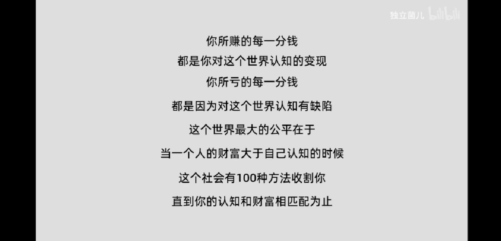

# 儒释道
* 友者生存
* 养真集
* 复性书
* 太平经
* 混元经
* 青囊经 青囊中书 青囊术 葬经
* 六祖坛经 给大家推荐的书：《1844年经济学哲学手稿》《共产党宣言》《关于费尔巴哈的提纲》《思想的力量》《传习录》《毛选》《六祖坛经》《存在与时间》
* 化书   无能子
* 器经
* 六祖坛经
- 《传习录》
- 道宗秘诀，西游秘文
- 中古之明书
	《论语》
	《大学》
	《中庸》
	《资治通鉴》
	《战国策》
	《长短经》
	《韩非》
	《道德经》
	灵岩语屑（南怀瑾与袁焕仙讨论最后悟道）
	素书
	反书
	焚书
	帝王术
	智囊
	河洛图书
	天文密码
	素经
- 阴符经 刘一明（清）
- 但是还有书籍
	1.  往事与随想
	2.  寂寞的游戏
* 最大的银行——探索生命黑箱

# 其它
- 工作消费主义和新穷人
- 《1844年经济学哲学手稿》
- 《共产党宣言》
- 《关于费尔巴哈的提纲》
- 《思想的力量》
- 《毛选》
- 《存在与时间》 ​
- 培根随笔
- abafi 作者josika
- 一片叶子落下来 写死亡的一本书(石国鹏推荐)
- 心流 知识就是力量
- 张五常 卖橘者言
- 李维史论
- 罗素
	自由思想的十戒
	幸福之路
- 最后的问题
- 物性论 大偏离
- 增长的本质
- BRAIN VALLEY 源自hello word

# 前辈
- 儒释道
	道家 杨朱 邵雍 倪海厦
	佛 元音老人
- 经济
	付鹏

卢麟元
温铁军
蔡志忠
北大 高鹏程
康德拉季耶夫

- 《万万没想到，用理工科思维理解世界》提到的一些书籍：
	《潜意识：控制你行为的秘密》
	《信息食谱》
	《我们如何决策》
	《谁赚走了你的薪水》
	《意志力》
	《思考，快与慢》
	《引爆点》、《异类》、《决断毫秒间》
	《天才密码》
	《如何阅读一本书》
	《超级人脉》
	《再冷门的问题也有最热闹的答案》
- 源于哔哩哔哩某视频（up主独立菌儿）
	《社会心理学》
	《第一本经济学》
	《学会提问》
	《认知心理学及其启示》
	《思考，快与慢》
	《超越智商》
	《思维与决策》
	《经济学原理》
	《“错误”的行为》
	《新制度经济学：一个交易费用分析范式》
	《现代制度经济学》
	《薛兆丰的经济学讲义》
	《博弈与社会》
	《自私的基因》
	《消费者行为学》
	《组织行为学》
	《沟通的艺术：看入人里，看出人外》
	《进化心理学》
	《发展心理学：儿童与青少年》
	
