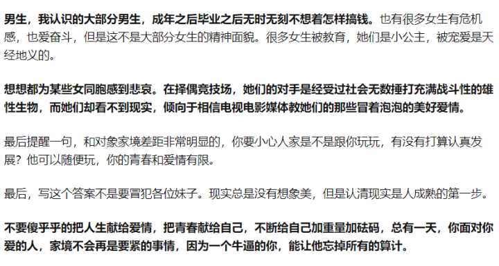

我记得在网上有一句话，**男人们买电子产品都要看无数的测评综合考虑，谈对象结婚这种人生大事，你以为他们会跟着感觉走不考虑现实吗？**

不打算跟你认真发展，只是馋馋你身子的，那可能无所谓，将来他的计划里么得你，你是否有家庭负担，你的父母社会地位如何，你潜在的可继承的资产多少，他都无所谓：因为跟他没关系。

而认真要谈对象，考虑要结婚的话，没人会蠢到不考虑对方的家境。

前几天我表弟让我帮忙买一款潮牌卫衣，我在网上搜了之后发了一堆选择给他。

“ 姐姐，你看这个怎么连帽上的绳子颜色和衣服不一样？”

我惊了，完全没在意这个小细节。

“ 我喜欢颜色干净点的。”

我以为男生们，分不清口红色号，分不清女生素颜还是淡妆，所以他们都傻乎乎的。

其实，**男生对喜欢的东西，非常非常细心而且挑剔。**

可能我圈子太low, 曾经我留学的圈子里，很多小伙伴私下议论某人，除了颜值才华之外，还会加上一句，他家里做什么的， 比如爸爸是局长或者妈妈是主任医师啥的， 要么就说某地有几套房子。

我一个朋友跟我说，他的朋友们都不会找农村来的，家里也不会同意。（作为农村人我听着有点尴尬。）

于是又想到我上大学的上古年代，有个农村妹子谈了一个公务员家庭的男生，大一谈到大四，要谈将来的时候，那个男生说，“ 我们分手吧，不然以后结婚了亲戚问我爸妈你家里做什么的，我们家里都是体制内，你爸妈是农村的，太不合适了。”

对，妹子是遇到渣男了。但是像这个男生这种想法的人，绝对不会是少数。

农村来的男生，如果家境很一般，是不是就不在乎女生的家境了呢？

错。他们在意。

要在大城市立足，很少有人不需要家里的帮助来买房。

我大学几个非常好的朋友是上海本地的女生，有个农村的男生总是拐弯抹角的打听妹子家里做什么的，住在上海哪里，具体到哪个小区。那个男生可能觉得自己问的很巧妙，但是成年人都知道他什么意图，妹子非常反感他这样鬼鬼祟祟的感觉，拉黑了，虽然是同学。

另外一个大学里的同学，他也是全村的骄傲那种，他无意识的聊过，他爸爸妈妈以为他考上了大学就会有有钱人家的小姐看上他。农村人的认识里，儿子考上大学真的非常厉害了，当然配得上城里小姐。所以以前非常流行的凤凰男的故事，农村婆婆那么得瑟，就是类似的心理。

凤凰男这些年被锤得没有市场了。但是又出现了新的大坑。

大家目标又集中到了高收入的人群，比如程序员和金融男。微博上有个什么娃娃的博主，非常受欢迎，她像教主一样教她的教徒怎么搞定高价值男人。参考日本有一类女人，目标就是嫁人，好嫁风之类的。女人在套路目标男人的同时，现在PUA培训层出不穷，男人也在围猎女人。

网络发达之后，最后一点神秘的面纱也没了。

大部分人心里渴望爱情，但是心里的算盘啪啪响。物质女一直被喷，搞的好像男的只负责提供物质他们不想通过婚恋获得物质一样。

这里无意冒犯任何人，但是我感觉在网上无意看到的一句话非常有道理。大意就是，你以为避开凤凰男找体制内的男人就简单吗，他们更加看重女方的家庭背景。

底层和中产阶级的男人看中女生的家境的原因，非常明显了。**穷人再找穷人，穷上加穷。中等人家也不会希望因为婚姻被拖累，阶层跌落。**

**不管什么阶层出身的男人，找对象，这里只讨论认真谈对象考虑未来的那种，都会有非常复杂的计算和考量。**

知乎有个问题是，为什么现在男生都不追女生了呢？

呵呵。

因为他要算计投入成本和产出呀！

现在随便一个女生谈恋爱，都被公众号抖音啥的教傻了。具体怎么傻，你们都懂我不赘述。

很多女生收入普普通通，但是找对象要求很高。花钱大手大脚，真的只要赚的钱够零花就觉得自己很优秀，噗。。。我要被锤死了吧。

男人要考虑买房买车，他哔哔哔脑子里算计一波，找个家境好的以后生活会怎样，找个家境不好的但是自己优秀的生活会怎样，找个家境不好能力一般但是贤惠的会怎样，找个家境不好能力一般还不贤惠的，是不是脑子有坑。

**人都是趋利避害的，你不要太高估感情。**

而且感情能保鲜多久？谈恋爱到最后结婚，那就是两个家庭的相处。

**没有人喜欢吃亏吧，没有人讨厌占便宜吧？明明是人性的问题，大家为什么换个性别就心存幻想呢？**

还有一个社会现象，毕业工作几年之后，男生普通会做得比女生好。这里有社会歧视的因素，有女生要生育影响职业的可能性存在，还有一点最重要的就是：**男人天性充满竞争，热爱竞争，本质好斗。**

女生，好像被包容可以柔弱，可以不那么拼。甚至还有不少漂亮女生高估自己颜值的威力，最可悲的是把美图里的自己当作真实的自己作得一比的那些女生。(目测要被锤死，锤我就是你对。）

在社会里涮了几年之后，男生的生存能力一般都会超过女生，对现实的理解也会超过女生。

我真的不爱说这话，因为我也是女性。女生在一起最爱讨论什么你们自己心里知道。

**男生，我认识的大部分男生，成年之后毕业之后无时无刻不想着怎样搞钱。**也有很多女生有危机感，也爱奋斗，但是这不是大部分女生的精神面貌。很多女生被教育，她们是小公主，被宠爱是天经地义的。

**想想都为某些女同胞感到悲哀。在择偶竞技场，她们的对手是经受过社会无数捶打充满战斗性的雄性生物，而她们却看不到现实，倾向于相信电视电影媒体教她们的那些冒着泡泡的美好爱情。**

最后提醒一句，和对象家境差距非常明显的，你要小心人家是不是跟你玩玩，有没有打算认真发展？他可以随便玩，你的青春和爱情有限。

最后，写这个答案不是要冒犯各位妹子。现实总是没有想象美，但是认清现实是人成熟的第一步。

**不要傻乎乎的把人生献给爱情，把青春献给自己，不断给自己加重量加砝码，总有一天，你面对你爱的人，家境不会再是要紧的事情，因为一个牛逼的你，能让他忘掉所有的算计。**

祝大家有钱人终成眷属。

（原文完，后面是根据评论私信里各种观点的探讨。超长预警！本来想删减方便大家阅读，但是码字不易，写知乎也是为了记录和分享，看不完莫勉强哈哈。欢迎参与讨论，大家可以有不同看法，**鼓励独立思考和质疑**，答主乐于倾听你的故事和见解！）

\~~~~~~~~~~~~~~~~~~~~~~~~~~~~~~~~~~~~~~~~~~~~~~~~~~~~~~~~~

10.06更新

刚开始写这个答案我怂怕被喷死，所以匿名。没想到很多朋友其实对我观察到的现象也有共鸣，谢谢你们的阅读和参与讨论。

同为女性，我相信有很多自强不息的优秀女性存在，只是普遍来说，出了社会，很多女生在学校里的竞争心好像就下降了。

这个绝对有社会和文化的影响，**男权社会，有意无意的在钝化女生的信心和竞争意识。**

比如从小到大的女生学习不如男生好，特别理科。中国从南到北从城市到乡村的重男轻女。不管家庭幸福还是不幸福，夫妻之间弱势的一方普遍是女性。

传统思想对女性的要求就是会把你变得很弱，不敢争，不敢要，讲奉献，讲成全丈夫和子女以及老人。

田园女权只教你利用性别优势要钱要物要地位，但是真正重要的是，

**作为女性，应该认识到自己在社会竞争中全方位属于弱势。**

（这里不是说女性弱，不如男的，懂的自然懂，不懂的，我也希望你永远不懂，但是你真的会慢慢感觉到的。）

家庭条件好的女生也不能完全幸免，只能说因为有钱免了很多的苦。普通女生，走出校园，男生让着你捧着你的时代就过去了。我们面临的是险恶势利的现实。

男生从小被教育要出人头地，女生呢？至今还有很多人认为嫁得好就完成任务，包括我爸爸也是这样希望的，找个好人家，安稳清闲过一生最完美。辛苦打拼什么的，让男人来。出于疼爱，很多父母也把女儿养废了。

我也算读了一些书，走了一些路。从最偏远的少数民族贫困山区走到上海，又去了德国。见过形形色色不同阶层的人。所以我可以非常肯定的说：按照我爸爸一厢情愿的设想，我会过的好的可能性，几乎就跟抽奖一样。

前几天的新闻，看到美丽的藏族姐姐拉姆竟然被前夫活活烧死！也许上知乎的人至少都是有书读的，不太会遇到这样的事情。然而现状就是，中国还有很多很多贫困的女性被当作附属。

我老家有句又黄又暴力的老话，娶来的媳妇买来的马，想骑就骑想打就打。底层女性的现状太可怜，我想来想去，也想不到拉姆小姐姐怎样才能摆脱这样的命运。

你说好好读书吧，她小时候哪里有这样的条件。人生轨迹被定格在底层，遇到的男人也就是那样。一生的苦难几乎也写成了，看到她的遭遇我真的哭了很多次。等她前夫的死讯。

还有小S，她在综艺界是怎样的地位80后90后甚至00后估计都很清楚。那是怎样一个古灵精怪，聪明伶俐的女孩。她女儿生日的愿望你猜是啥？“**我希望我们三个永远都不要结婚。**”

婚姻的苦，你看看小S女儿们就知道了。那是老百姓无法企及的富贵生活，依旧保不住小S的幸福。

女孩们真的，**恋爱，结婚，都是人生非常重大的选择，你一定要用准备高考的努力去思考你的选择。**

深夜大哭的小S到底是为了什么?她说感谢大家，那天是她生日，喜极而泣不是这种泣法吧。

还有一次她直播中，她老公大骂一句“你真的很恶心！”

以上都有视频为证，并不是媒体乱写。

给无数人带来那么多快乐的小S，在她的婚姻里，完完全全是另外一个人。她拼命解释，每次老公被拍到和靓女乱搞，都会有她出来澄清。她真实的婚姻生活，细想是种折磨，真的不忍心。

这当然是个例，只是你想，拥有事业，颜值，金钱，地位，有趣的性格的小S，都不一定能拥有正常人平凡夫妻的快乐。

**妹子们可以向往爱情，但是婚姻的目的不是为了让你被宠爱做快乐的小公主， 婚姻背后是精密的算计，参与的每一方都有他们的目的。**

你结合她们的例子来理解贾宝玉的话，**女孩子结婚之前是珍珠，结婚之后就是鱼眼珠子**。

小时候我很肤浅，以为是婚前少女如花似玉，婚后慢慢变老所以失去了光泽。

在社会讨生活多年之后，我才明白，不管什么样的女人，走进婚姻，她的生活会有多大的改变：

有的要掉一层皮，有的要丢一条命。

幸运的女人婚姻幸福的肯定有，但是，更多的人就被吞没了。

**写这个文章我也觉得很残忍，初心是希望帮助更多的妹子理解我们所处时代的现实。**

**个人努力能改变的事情已经越来越少。你看看房价看看生儿育女的成本，越来越多本来寻找爱情的人，就像评论里说的那样，只能从现实里寻找爱情。**

**那么从爱情里寻找现实的人，很容易就要失望。而对女生来说，更残酷的一点是，试错的成本太高，给你试错的时间太短。**

**有可能遇到一个不合适的人或者渣男，再纠缠几年，你就完球了。**

**愿各位操心脱单的同时多操心脱贫，走入婚姻之前不要对男人抱有不切实际的幻想。**

**想要幸福，就只能丢掉幻想，准备战斗！**

**~~~~~~~~~~~~~~~~~~~~~~~~~~~~~~~~~~~~~~~~~~~~~~~~~~~**

10.07加更

评论里朋友说，我写的再通透，还是有人没办法理解，然后生活也不会有啥改变。

果然我看到有几个人再说，人穷就别谈恋爱了呗啥的。

心疼他们，真的阅读理解能力这个样子，不是我多写几句能解决的。

人穷怎么办？我不想展开了，之前一个很多人赞过的文章里有讲我的看法的建议，感兴趣可以读一下。

[女生们，你们在婚姻里面最大的底气和凭仗是什么？www.zhihu.com](https://www.zhihu.com/question/354192752/answer/921225531)

​    

评论里一些小仙女说，不谈恋爱了只想努力打拼。

先为你们自立自强点赞。但是恋爱是这么美好的事情，努力打拼的同时也可以和谈恋爱呀。

看清现实已经很折磨，看清了之后还要继续去爱，那更是考验。人生的乐趣就在于不断突破自己呀。

**我写这篇文章绝对不是让你不要恋爱的。**

清醒的看待自己和周围的环境，热烈的去爱，我觉得某个女作家说的真的很对，爱是一种英雄主义，是麻木生活里的激情。对不起我忘了原文，只记得我的理解啦。

**心里有爱的人，不管多难过多沮丧，只要他在，我就很踏实。**

**可能这个时代还在强调真爱过于装逼，如果可能，我还是建议你用心去爱一个人。我前面二十多年都在努力读书，努力搞钱，（也没搞到），除了个人的梦想之类的，还有一点就是希望我遇到我爱的人时，不要太狼狈，不要自卑，不用担心他或者他的家庭会看不起我和我的家人。**

条件不好的男人遭受的压力，我竟然也有。

因为我虽然出身贫穷，但是绝对无法忍受别人的嫌弃，轻微的一点点的不行。

**我拒绝被施舍，拒绝不劳而获，我喜欢花我自己的钱自由自在的感觉。**

所以我就从来没有想过要高攀谁。

通过婚姻致富会让我如坐针毡吧，真的不喜欢占别人便宜。**不是因为我清高或者不爱钱，而是年纪越大越知道人不能随便伸手，别人给你了好处，你脖子上就多了一条链子。**

我见过很多美丽聪明的女孩，找的对象可以跨了好几个阶级。但是我发现她们除了比一般女孩漂亮优秀之外，真的需要比较“懂事”，比较“贤惠”，比较“包容”。这是我有限的认识，不代表全部。

然而对我来说，自由自在不用看任何人眼色行事，是最宝贵的东西，也是我能够成为我存在的最基本的条件。想明白这一点之后一切都简单多了。

比如曾经有遇到条件很好，一线城市有别野父母是大学教授还经商的人，他的态度里有那么几分倨傲，言语中经常贬低我的学业和对专业的理解。我的第六感告诉我，非良人。我想找一个对我平等相待的人。

还有评论里也有姐妹聊到了家境不好被分手的经历。这些绝对绝对真实存在。

你们知道很多男人会跟爸妈演双簧吗？谈恋爱的时候家长想，我儿子又不吃亏，有人陪。那么即使他带你回家见了爸妈，爸妈态度还可以，也不一定代表他们就同意支持你们结婚。

人家爸妈可能也只是逢场作戏，反正他们觉得儿子不会吃亏。

到后来，玩腻了想分手，ok爸妈或者亲戚就可以出场了，不同意，各种挑事儿。

我亲眼见过，一个非常好的姐姐就是这么被坑了。前期谈恋爱，男生家里条件非常非常好，那个姐姐人特别漂亮。人家爸妈各种送她礼物叫去家里吃饭，最后要谈婚论嫁，男生的姑妈突然冒出来说要找个门当户对的，在家族聚会上当众让姐姐难堪，其他人默许姑妈搞事请。

那个姐姐家里爸妈都是知识分子，绝对不差，只是比不过男方家里体制内职位高罢了。

回来那个姐姐就他分了手。态度很明显了，只不过借由别人的嘴巴说出来难听的话。

所以有时候他的家人为难你，你好好想想，这是不是也是他的意思。只不过家人负责演坏人，他来演好人。

很多说什么家里不同意的，真的，真的，就是那个男的自己也不咋坚定，放任他的家人搞事请。

有时候你被分手，对方各种挑剔你的问题，你想想如果你爸爸是土豪或者大佬，他会不会包容你。

知乎以前经常被吐槽的，漂亮北漂女，被土著男套路的故事，她谈过本地条件好的，就认为自己应该配这样的人。但其实人家只是馋你身子，打着谈恋爱的旗号比较方便和好玩。爱，可能也有几分，负责是不打算负责的。

**阅历不够又略有姿色的物质女，常常沦为别人的猎物。**

小王子说，真正重要的东西要用心才能看到。这篇长文一直都在讲家境，条件，钱。但是最后，我还是想说，真挚的爱是最宝贵的，跟物质无关，跟外表无关，你真的需要用心才能看到。

前文开玩笑说会被锤，他们都没有锤我，感恩。脑子是个好东西，真高兴我们都有。

\~~~~~~~~~~~~~~~~~~~~~~~~~~~~~~~~~~~~~~~~~~~~~~~~~~~~~~

10.08再次更新

收到好多小伙伴的私信，真的不要再问我你的对象靠谱不，你跟他朝夕相处都不知道我一个网友咋会知道呢？

还有几个小伙伴说，正在经历分手，结合我的回答看，释怀了很多也准备继续提高自己，你们好样的哦！

还有妹子私信我说，**突然清醒过来，不能依靠对象，自己要也进步，我的天啊，写这么多文字就是希望有这样的效果！！！！！**

也有读者说看了很丧，那肯定有不在乎家境不顾一切也要爱情的人，我们就谈真实发生在你身上的概率有多大？与其期望别人，不如自己来掌握人生，对不对？

还有这几天多了很多关注我的小伙伴，谢谢你们啦~我的想法肯定有很多局限性，也许过几年又会有不同的感悟，那重在参与嘛，和读文的小伙伴们互动交流是很快乐的事情，特别看到你们说有启发有帮助我简直太开心了好吗。

评论里说到一个事情我又忍不住跑来更新。

就是有人留言说，好女人娶回家，他看不上的就睡睡走人。大意这样懒得翻评论了sorry。好像还吵起来了。

我想说，有的人批评我现实薄凉，其实呢，我只是说了我看到的情况，不代表我认为这样就是对的，你也不能因此就认定我很坏怎样的。现实不会以个人意志为转移啊！

我也喜欢大家可以嫁给爱情，可以抛开门第世俗观念相爱，但是现实不是这样的。

那么留言里说随便睡睡女人这样的情况有吗？我跟你们说，太太太太多了！！！！！！！

你问他你怎么可以玩弄女性有用吗。没有用。

排除掉自己想睡睡玩玩的女性，那些奔着感情去却只是被利用了下身子的妹子，该怎么办？

我觉得从古人的智慧里你可以找到答案，**女孩矜持一些真的不是坏事情**。

古代男人要么去青楼，要么要三媒六娉才能拥有性生活。

现在观念很开放，跟喜欢的人做点爱做的事情也无可厚非。

**但是你怎么知道跟你做爱的人是否真的爱你？**

我曾经二十出头的时候性观念非常保守，认为性是一个女生可以给男生最美好最珍贵的东西。我朋友反问我，**那么万一有个男人号称非常爱你表现得也非常爱你，就是为了跟你发生关系，你该怎么办？**

哦，我真没有想过这个问题。以前我傻傻的认为，我如果把我最宝贵的东西给了你，你无形中也就跟我有了契约，你就应该对我负责珍惜我。

这也是我自己一厢情愿的想法，我朋友的提醒让我害怕，

**性，原来不是承诺，也不是契约，更不是感情的保障**。

他说，**中国人都是这样，性的仪式感很重。性就是性，它没有那么多的重量。**

这个问题到现在是不是很简单了。

现在的男人想要性生活，也许只需要在某个天真妹子那里表演出非常爱她哄她开心让她觉得是真爱，那么适当的契机下，他是可以得到他想要的。

特别是缺爱的妹子，没有自信的妹子，如果遇到一个老司机，她可能都分不清真心和套路。

那么评论里说的，随便睡睡，真的是有可能发生的。

你们不要低估年轻男人的性欲，我大学的时候有个男生考研期间突然追我们隔壁宿舍一个妹子，也在一起了。但是寒假回来竟然就分了，我问妹子，她告诉我那个狗男人要她去开房，妹子还是处女，也没有那么开放当然不愿意，于是就分了。

借口不过就是你们熟悉，不愿意给我就是不爱我之类的。

我的好朋友跟那个狗男人是隔壁宿舍的，他告诉我，速速你不知道吗，那个谁就是考研的时候比较寂寞想找个人玩玩而已，不让睡当然下一个。你以为呢？

妹子哭得很伤心，我在食堂遇到那个狗男人也指桑骂槐的讽刺他不是人。可没啥卵用，他很快就带着一个染指黄头发穿紧身黑色的妹子进进出出 亲亲我我。

对，那个男生是一线城市有房等着结婚的，坊间都这么传，他条件很好，个子高很白，说不上帅但一堆理工男里面比较清秀。

人不可貌相啊。

有的男人很有素质，他们也有性欲，但是不会随便撩个妹子发泄下性欲就完，他们会克制自己，会考虑能否对妹子负责，然后才会考虑自己的欲望。

而有些男人，真的就不是性别的问题，他们可能都不是人吧。

留学圈子里有个很帅的男生，也是大城市有房那种条件很好很受欢迎的类型。他有个女朋友，给他做饭洗衣服，对他特别好。但是还是分手了。之后男生又开始追一个他真的非常喜欢的妹子，我从来没见过他那么手足无措，小心翼翼。

后来他终于追到他的女神，可是女神说了，婚前不能有性行为。女神可能也没有太多恋爱经验，所以连一些亲密的动作都不太愿意。

最后还是分手，他说还是比较想念前女友，说没有珍惜她，以前她忙着给他做饭啥的都没在意，后来他各种围着女神转，给女生下厨烤点心，还是没有抱到女神归。

我骂他你看你渣男了吧，幸好有女神治你。

“唉，没办法呀，我当时确实不是很喜欢我前女友，但是我喜欢跟她啪啪啪。”

（放心，听到这句话我就跟他心里友尽了，对自己同床共枕的人都这么薄情，对其他人能好到哪里去。建议真的不要跟渣男做朋友，这种人道德很低说不定什么时候就坑你。）

我真的没想到，男生被宠坏了之后也是很欠揍。他前女友分手很伤心，还以为她不如女神优秀，其实吧，女神没有很漂亮，就是男生喜欢她而已。

这种事情我不知道有多少，但是最好不要低估一个被性欲折磨的时间很多的年轻男人。

说说早安晚安，学学撩妹套路，坚持上几个月就能有性生活，对他们来说时间不是成本，why not?所以有了评论里说的，随便睡睡。

我爸爸从小就教我，不要对男人的小恩小惠感恩戴德，他们做的那些事情都太小儿科了。

**缺爱的妹子你们真的要注意了，太容易被小事情感动而忽略男人的真实本质很可怕。**

**你分不清爱和感动，人家分得清。**

**很多很好很老实，会对你负责的男人，他可能这辈子就没有想过什么撩妹套路，你需要一点智慧，识别出正直可靠的男人。当然我也有私心，人品好之外，尽量选择聪明的努力的有前途的。**

可是很有可能你只看外表，只看小的方面，而看不到一个优秀的男人：他可能外形很不出众。

所以很多适合结婚的男人默默无闻的单身，撩妹高手换了很多任。

打开交友软件，到处都是猎人和猎物。

而我们很多人对性的认知还很朦胧，因为家长和社会的回避可能对性的理解很扭曲。

我的公众号后台还有一个妹子问我，说她大学和男友发生了关系，觉得非常对不起爸妈。现在大三了，对象好像有点对她不那么上心了，她很难过。

我看完真的不知道说啥好。妹子的性观念已经让她很痛苦。

我劝她发生了就不要再想，也没法改变，爸妈反对一般也都是怕你受伤害，如果你保护好了自己，当时也是情到浓时你愿意的，那就没必要耿耿于怀。不如专心自己的学业和未来。

女生对自己身体，对性的理解真的很有可能停留在上世纪。我不是鼓吹性自由，而是看到很多女生就因为发生了关系而觉得自己的价值就低了，就丢人，或者就依赖上那个男生，即使对方已经不合适，还要因为曾经有过的性而困住自己。

我前文已经说了，女孩子矜持一点真的是对你自己的保护。至少急吼吼馋你身子的人没法得手，考验一下确定是走心的，你再做一些事情也不急。当然我认为，慢慢来，多认识对方，不是坏事情。

**但是如果你真的做了怎么办呢。你还是你呀。**

妓女都有机会重新做人，你只是在爱情里遵从了本性而已。

**不要浪，也不要因为性而依赖一个并不怎么样的男人。**

我之前在知乎看到一个一线城市土著男聊他这些年靠着几套房一辆好车，泡了很多北漂女。他还说，那些女的想上位嫁给他，装的很贤惠很懂事，放长线掉大鱼。所以他都不用花什么钱就可以睡到。他当然不可能跟她们结婚的啦，就是睡睡。

这些女孩肯定也是一个愿打一个愿挨，和北漂男一起奋斗可能留不下来，可能会很难，如果可以套住一个土著，这她们也可以少奋斗半辈子一辈子甚至几辈子。

个人选择而已，我不想说对错。

世界上有形形色色的人，就有各种各样的路可以走。有的人就是命好婚姻幸福，有的人明明很好却总遇不到好的人。 年纪越大越相信命运，人的意志在时代的洪流下太过于渺小。

“唉，你们小姑娘真的最可怜了”，这是我爸爸有一次吃饭看着我心酸的说。

我咋会可怜呢？

我越大，越知道老父亲当年心里的苦。

**他比我知道女人的一生会怎样，所以我看着他不论贫穷还是富裕，健康还是疾病，都守护着我妈妈。我很幸运，至少我见过真正爱一个女人的男人是怎样的**。

女儿出嫁，爹妈会哭。为什么哭，高兴之外还有别的情绪吧，这里你不用问我为什么。

我姑姑嫁人之后被家暴离婚带着小宝宝，我爷爷立即给她买了一套房子，让她至少有个家。（这里有人问，解释一下，２０００年前后在小县城买的，不贵。）

而很多女孩，可能出身在比较普通的家庭，资源不会太多给她。更惨的是可能出身在重男轻女的家庭，那婚后除了丈夫真的没有太多的依靠。

我相信知乎上肯定幸福的女孩比较多，而社会上有的是可怜的女人。你想想你的妈妈是不是经常要牺牲自己。或许我们已经对妈妈的牺牲习以为常。

当我也到了可以当妈的年纪，我发现女人真的好难。生育会影响职业发展，让本来就对女性有隐形或者明着来的歧视的职场更加艰难。

生育本来就有风险，朋友的妻子生孩子顺产生不下来又去剖腹产，我姐生娃之后乳腺堵塞，痛得她哭天喊地，生娃都没哭啊，医院整个住院部隔着几楼都能听到她的惨叫。

男人可能会觉得，女人都要生娃啊，别人也生 不是很正常吗？

那人人都会死，你现在死了也没事吧。

我越大，越想拼命对我妈好，她真的太不容易了。看到这里的男孩子们，以后你们结婚了，也好好好对待为你生儿育女过鬼门关的女孩吧，真的你看看生孩子的视频，你可能会很震撼，会改变很多你的想法。

生育只是其中一小部分。所以结婚为什么家长都希望你找条件好的，因为爱情真的不能当支票，有很多问题有钱就不是问题。不管男女都好好工作，多存钱，这个疫情之后大家肯定更加深有体会吧。

如果一个女孩想要幸福能怎样呢，美丽的拉姆小姐姐像天使一样为什么会被活活烧死。

**我没法给出普遍适用的答案，只能建议大家，在你能掌握的范围里尽可能的掌握自己的人生，抓住一切的机会跳出不好的环境，像男人一样无惧风雨去磨练自己，自己一个人也可以过很好，有缘了遇到合适的人，也不会因为自己太弱而抓不住。**

**真的，你很弱的时候，你状态不好的时候，你不仅考不上好大学，找不到好工作，连很好的男人你都没法拥有。**

**但是乐趣也就在这里，你慢慢的改掉自己的缺点，不断逼自己去做你不敢做的事情，从而成为比原来更好的人，那个人来了他也会爱上闪闪发光的你。如果没来，你也度过了充满挑战快乐的一生。**

写到这里已经不知道主题是啥了，反正评论里私信里有什么我想聊的就更新在这里，欢迎大家继续讨论。

关注这个答案的人越来越多，我很开心能帮到这么多不认识的人！

网络情缘一线牵！

知乎最话痨的答主 [@速速](https://www.zhihu.com/people/a2244f0bc53af50a2703a0afb219c8cc) 是我没错啦。小伙伴觉得文章有用可以关注我，我热爱答题跟大家分享自己的思考。当然不关注也没事哈哈。

另外我很犹豫但是还是决定放一下我半年没更新的公众号：欲速不达，ID：Dsusu168

犹豫是因为不管我写了什么，只有最后放了公众号好像就会被喷营销号，编故事啥的。

你关注我我啥都不送，没啥好处，就是里面有很多我这些年写的东西。你喜欢本文那也会发现更多我对不同事物的思考和看法，公众号没有评论功能，但是欢迎私信跟我交流。

另外知乎私信评论太多，关注公众号的真爱粉福利是你给我在后台留言我回复的可能性会大很多。时间精力有限，我所有的分享都是无偿的，帮助别人的快乐以及和大家讨论产生的新的想法就是最好的回报。所以别喷我，来去自由请便，我只是提一嘴，因为有的人可能会感兴趣。

看看已经写了超过一万字，看到这里的都是真爱。我觉得现在大家都忘了分享和给予其实会比得到更快乐。感情里是这样，人与人之间也是这样。

我尤其不喜欢在感情或者友情里算计的人，只是现实如此。

很多人其实连自己的感悟都不愿意分享给别人，毕竟我走了弯路我思考了我花时间了才得到的结论，为什么要告诉你？

而我是真的乐于分享，别人的批评建议赞赏都有好的作用。特别是评论里私信里很多姐妹跟我说她们从我的文章里得到的收获我非常开心，人到中年，已经很难发自内心的单纯的快乐。

所以小伙伴们也可以用实际行动鼓励下这么真诚的老姐姐点个赞点个关注呀！如果你去公众号找我我会更开心的！虽然半年没更新以前还是写了很多文章的。

本来都放下手机可是看到一个妹子的留言给我整泪奔了，还是继续写吧。

我们来聊聊穷人该怎样拥有美好的爱情。

妹子留言说，对方送来贵的礼物她无法回赠同样的东西，就觉得自己不配，所以选择自己孤独。

是二十岁的我没错了。

因为出身贫穷而自卑自闭，只有心里一点小小的梦想支撑着我在诺大的繁华上海。

我前文提过我的父母都是中国最低收入的农民，所以当我18岁到了上海22岁到了德国，几乎除了满腔热情和一股年轻人的勇气，我一无所有。（夸张了，保证金还是凑够了的，但是穷是真的穷）

这些经历给我的启发是什么呢？

是我爸爸告诉我的，钱能解决的不是什么事儿，还有很多事情钱不能解决。

所以我猛然间发现，虽然我没有钱，但是我多动脑筋，我勤快一些，我再乐观一点，勇敢一点，原来穷也不是那么可怕的事情。我还是可以做我想做的事情，穷根本不是借口，除了钱还有很多很多牛逼的技能。

爱情也一样。以前我担心我外表太普通，衣服太寒酸，性格太拧巴...

后来我才知道，爱情根本不讲道理也不按你的设想来，爱就是那么自然而然的发生了。

所以在我很穷的时候我也爱上过一些男生。真的要感谢他们，我都这么穷了还会爱上我。

我也想不出原因，可能因为我无所求，也可能因为他们从我身上也看到了他们自己。

我们初中其实就有人谈恋爱了而我没有，因为大家恋爱的第一步往往是交换电话偷偷煲电话粥。

然而我没有这个困扰：我家里没有电话，我更不能让别人知道我家里没有电话这个窘迫的事实。

贫穷真的会让人自卑，全方位的自卑。但你不要丢掉自己的志气，真的不会穷太长时间。

**三年穷是运气问题，十年还穷是你的问题。**

在我到处打工，狼狈不堪的时候，也遇到过爱情。

**我总是以为等我脱贫了人模狗样了才会有资格去爱，可是我发现老天还是偏爱勤恳的小孩，在我落魄的一比的时候还是遇到那么好的人。**

最后没走到一起有很多原因，但是我绝对不怀疑曾经的真心。

如果这篇文章让你消沉那你就错啦，爱是美好的，在你不名一文的时期还能发现你的美好的人，真的值得铭记。

我不能保证你会遇到这样的人，就想请你相信，再怎么计算，心和心之间的吸引是纯粹的。

人活一世不容易，我记得看过一句话，说上帝把我们送到人间，就像羊入狼群：要像鸽子一样善良，像蛇一样机敏。

爱一个人和被一个人深爱都是一生难忘的经验，相互算计也是人在江湖身不由己。

我们生而平等，我们值得被爱，我们也愿意去爱。

\~~~~~~~~~~~~~~~~~~~~~~~~~~~~~~~~~~~~~~~~~~~~~~~~~~~~~~~

10.09加更

写这个超长的回答不是对男性有意见，评论里也有很多男生赞同我的观点。

男生现实，我认为不全是坏事。因为结婚不是谈恋爱，结婚之后要考虑的是一个家庭在社会上怎样立足，要考虑到养育子女的实际成本，要操心子女的教育，这些东西都离不开钱。

如果大家都不用为生活所累，我相信不管男女，都想拥有爱情，都想跟最爱的人结婚。

我写的东西只是个人感受，很多特殊情况也没有篇幅一一排除，已经这么长啦！

**大家带着自己的思考阅读，批判性理智的接受你们需要的内容就可以了。**

**每个人情况不一样，我的理解是基于我的人生经验，不管听到了什么道理，我们都不能忘记毛爷爷说的，具体问题具体分析。**

10.10继续更新

没有想到还有很多人在关注我的回答，评论里又发现了值得讨论的内容，话痨答主绝不被长度限制，继续分享。

也许我文章中说女生在一起讨论什么可能刺痛了一些妹子的心，先说声抱歉，没有冒犯的意思。

而是我真的发现，大部分女孩子，可能也操心学业，在事业上也有抱负，但是比例真的不如男生里面多。因为，媒体每天无时无刻都在欺骗你！！！！

要瘦，要白，要漂亮，要有少女感。要买这个斩男色，要拥有这只手袋，要穿上这条仙女裙。

这些都在强烈的暗示你，你变成广告里的样子，你就会被男人爱上，你就会受欢迎会幸福。

你想想消费主义是不是这样骗你？（当然他们也有针对男人的策略，男人被骗，数额更大更惨）

同样，综艺，抖音，微博，包括知乎，都在用不同的噱头吸引你的注意力。

我为什么留在知乎，一而再，再而三的更新，就是我想发出自己的声音，主流媒体太少告诉女孩子，你要注意自己的价值，你要奋斗，你可以有不同的人生。

包括励志剧，什么《三十而已》马伊俐演的那个离婚女人，打着励志的旗号，要么脱离现实太多，要么终归还是靠男人，靠美色。

这些，我相信有人可以做到，但是普通女孩，没有惊人美色，没有电视剧里的外挂奇遇，也只是骗你开心的，甚至是愚弄你的。

上过高中的人都读过大儒贾谊的《过秦论》， 里面有段话我想分享，虽然贾谊论的是时事，用在男女关系里也一样适用，当然西方也有类似的理论，叫奶头乐。

**...于是废先王之道，焚百家之言，以愚黔首；隳名城，杀豪杰，收天下之兵，聚之咸阳，销锋镝，铸以为金人十二，以弱天下之民。**

秦始皇得天下之后，焚书坑儒，**以愚黔首，**把兵器收集起来，**以弱天下之民。**

小某书，直播行业某些大V，铺天盖地的软文，没啥营养的综艺，全部全部都是为了赚你的钱，影响你的价值观，愚弄你，让你“买它！买它！”或者对着综艺傻乐**，把自己没有能力过上的生活通过网络看看过眼瘾，而忘了你其实是希望争取的。**

**你的时间，注意力，意志和长期积累的技能，都是你闯荡江湖的兵器，然而都被消耗了，整个人也被弱化。**

所以评论里在争说综艺该不该看，女孩子沉迷的那些东西该不该买。

我不想说适可而止或者尽力而为的话，因为有太多人，**不分男女**，只要沾了物欲，就很难自拔。

裸贷，网贷，消费贷，资本家那么好心借钱给你花哦？反正最后你完蛋。

你们可能不知道，为了让你们花钱买，为了让男生沉迷游戏，背后是多么强大的团队在努力，心理学家，大数据分析，优秀的程序员，一批一批大V收钱下场安利。。。。

奶头乐的理论就更简单了，低级的娱乐消遣，占用屌丝的注意力，他们沉沦其中，不再奋斗，不再考虑改变现状，安安心心做资本家给他们的韭菜角色。

女孩也是啊。男人买不起房会被周围人嘲笑，女人没房大家会说，那你嫁个有房的。

男人事业没起色，周围人也会给他世态炎凉的体验，女人反而事业太好一堆人就说她女强人，干得好怎样没有家庭。

你看看这个社会是怎样愚弄女性的。

让女性安于做那个温顺乖巧，配合男人事业的贤内助。

不会鼓励女生争取往高层走，往尖端行业冲，那是男人的世界。

所以有个网红出了董明珠仿妆那一期，我真的被恶心到了。那个网红代表了低俗的审美，看一个女人，外表比内涵重要，董明珠绝对是中国女性的巅峰代表之一，讲真，那个网红不配。

姐妹们被媒体骗得要学习某幂啥的保持少女感，明星们的努力你们其实很少有可以借鉴的地方，那个行业称之为绞肉机都不为过，还是骗了很多年轻人的希望。

讲真，我对现在的综艺很失望，我对现在的媒体更失望。

年轻人沉迷其中，确实快乐。那我们的未来在哪里？年轻人明明有更重要的事情要做，更有养料的东西可以学习，却被这些为了钱黑了心的狗东西迷住。

我对综艺对各种买买买没有意见，利益不相关，只是想提醒有缘的朋友，这个世界有很多更有价值的东西等着你去探索。

比如怎样提高你个人的综合能力，提高你在社会上的竞争力，怎样修炼自己的内心成为更强大的人。

买买买来的东西真的过眼云烟，当季流行，为了赚你的钱，放心，下一季就过时了会逼你买新的。

哈哈一笑的综艺，拍出来的都是他们想让你看到的。我拒绝被喂食，我自己去寻找养料：多读书吧真的。

我今天为了保持准确性，重新再看了一遍过秦论。读到陈胜吴广起义，

然[陈涉](https://link.zhihu.com/?target=https%3A//baike.baidu.com/item/%E9%99%88%E6%B6%89)[瓮牖](https://link.zhihu.com/?target=https%3A//baike.baidu.com/item/%E7%93%AE%E7%89%96)（yǒu）[绳枢](https://link.zhihu.com/?target=https%3A//baike.baidu.com/item/%E7%BB%B3%E6%9E%A2)(55)之子，氓（méng）隶(56)之人，而迁徙之徒(57)也；才能不及中人(58)，非有[仲尼](https://link.zhihu.com/?target=https%3A//baike.baidu.com/item/%E4%BB%B2%E5%B0%BC)、[墨翟](https://link.zhihu.com/?target=https%3A//baike.baidu.com/item/%E5%A2%A8%E7%BF%9F)〔dí〕之贤，[陶朱](https://link.zhihu.com/?target=https%3A//baike.baidu.com/item/%E9%99%B6%E6%9C%B1/81896)、猗（yī）顿之富；[蹑足](https://link.zhihu.com/?target=https%3A//baike.baidu.com/item/%E8%B9%91%E8%B6%B3)行伍(59)之间，而倔起[阡陌](https://link.zhihu.com/?target=https%3A//baike.baidu.com/item/%E9%98%A1%E9%99%8C/4469)(60)之中，率疲弊之卒，将数百之众，转而攻秦，[斩木为兵，揭竿为旗](https://link.zhihu.com/?target=https%3A//baike.baidu.com/item/%E6%96%A9%E6%9C%A8%E4%B8%BA%E5%85%B5%EF%BC%8C%E6%8F%AD%E7%AB%BF%E4%B8%BA%E6%97%97)，天下云集响应，赢粮而景从(61)。山东豪俊遂并起而亡秦族矣。

就是这一段，也不觉泪崩。这种勇气太让人敬畏了！

放在我们个人身上呢？

**我们可能出身很低，才能不及中人，没什么智慧，被生活打击得非常疲惫困顿，势单力薄，可能一个人在大城市里面对所有的困难，但是把你以为不可以逾越的高山当作强大的秦朝，你敢不敢像他们一样发起进攻？**

当时贾谊大儒这里是批评秦朝的跟我们没有太大关系，这种勇敢**挑战不可为**的精神还是让我泪流。

我在评论里看到很多人说自己穷，自己没什么优势，很普通，准备随便过一生。

也许是自嘲，我真的觉得古人的智慧和勇气可以帮到你。

《过秦论》是中国优秀文化里的一颗珍珠，我们的文化真的是一个宝库，身为中国人，我前面批评了很多我们社会的不好的地方，但是我最后也想分享我作为中国人学到的好东西。

**汉字和书籍记录承载了几千年的智慧积淀，那些奶头乐的东西简直垃圾不能相比。当然有的人即使识字也无缘，读书，也要用心体验，结合实际来思考**。这些方面我也是小白，但是稍微有点体会就受益匪浅。

说了这么多，我可能又跑题了。但是话痨答主总有能力拉回来，你看，单单读书一项就有这么多乐趣，一个男人，你至于吗？哈哈哈。上面就是个例子，**自我提高，读书学习，无穷尽的乐趣。男人不应该在我们世界占据那么大的比例，爱情很美好，但是美好的东西到处都是。**

想要拥有爱情，真的，可能你需要做很多跟爱情无关的东西。

**当你有稳定甚至强大的内心世界，丰富到让人着迷的精神领悟，有点品味的男人一旦碰触，根本舍不得放手。与其苦苦思索如何套牢一个男人，为什么不做那个让人追逐你仰慕你的大女人？这种强大不怕时间流逝，不怕容颜老去，甚至肉身死去感情都会永存。**

男人很现实，是现实逼他们现实。毕竟几千年让男人养家天经地义，他们的责任在那里。

现在时代变了，我们终于有机会从历史上名字都不能留下到现在可以创造历史，改变历史。（这里你可以想各种女科学家的名字）

我觉得女孩目光可以远一点，去搞定比婚嫁更难更伟大的事情。你生活在这个伟大的国家伟大的时代，并不是为了谈谈恋爱嫁个人。

**你应该去探索世界，在途中发现自己。去拥抱你的才华和不足，点燃你生而为人的勇气，迎接未知的未来：不管结果好与坏，你知道你的人生没有虚度。**

**你已经是身经百战的勇士，不再是那个为了爱情为了个男人哭哭啼啼的小丫头。**

好莱坞没法理解花木兰，电影动画版的木兰有小龙帮忙，有祖先的灵魂保佑。电影真人版的木兰莫名其妙拥有开挂技能？而每个中国人都懂，我们的木兰，就是个普通的女人，因为爱家人，挑战不可为，因为爱国家，视死如归。

我们明明有那么优秀的女性作为榜样，一千多年后，我们不该讨论如何成为金丝雀。

**士不可以不弘毅，任重而道远。**

感谢各位的阅读，你有好的体会也欢迎分享。

不能再更新了，大家读得累死了吧。最后的最后，如果你觉得文章有用，还想看到我更多的更新，可以关注我 [@速速](https://www.zhihu.com/people/a2244f0bc53af50a2703a0afb219c8cc) ，也可以去公众号找到我： 欲速不达，（ＩＤ：Ｄｓｕｓｕ１６８），需要转载记得联系我，请尊重原创，谢谢阅读！

10.20更新

没想到再一次更新是因为有读者发现抖音有人在抄袭我。还有评论问我和抖音那个是不是一个人，哦，可别，那可是老抄袭了！下面是另一位知乎用户宏桑的文章，他也被抄袭了，不知道后续道歉没有？ [@宏桑](https://www.zhihu.com/people/1599260fee4bfb87075608990678de5d)

[宏桑：抖音400万关注的心理学大V孙能能，抄袭知乎文章zhuanlan.zhihu.com](https://zhuanlan.zhihu.com/p/166207515)

​    

孙能能，《感情的现实》这一期，照着我的稿子读，没有事先征求过授权，我网上一搜，他抄袭知乎答主的行为早就臭名昭著。这样一个劣迹斑斑的人，打着复旦大学，心理咨询师的旗号，呵呵，坐拥400多万粉丝，真有意思。

讲真，这种人设的男人应该 很多妹子的白马王子吧？

打脸来得特别快，妹子们看看吧，包装再好也只是为了赚你钱，人设再吊炸天，也不过是抄袭别人劳动成果的小偷。

请支持我文章的朋友，帮忙去抖音举报他的视频！不问自取是为偷，不要纵容这些人！

举个例子，下面黑体的部分，他就是一字不改照着读了。我懒得去截图他的视频，大家举报的时候，请附上我知乎回答的截图，比如下面这张，然后附上我的回答链接，作为证据，谢谢你们！

